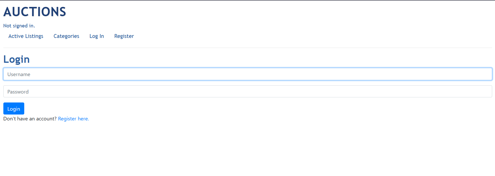
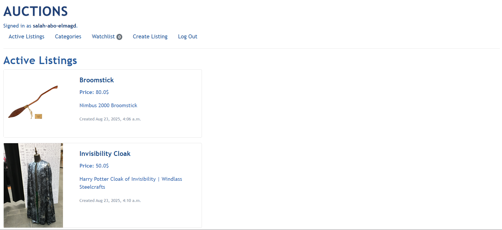
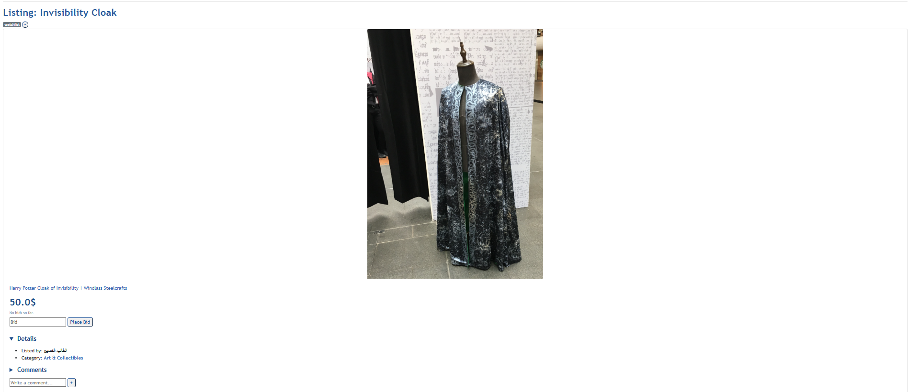
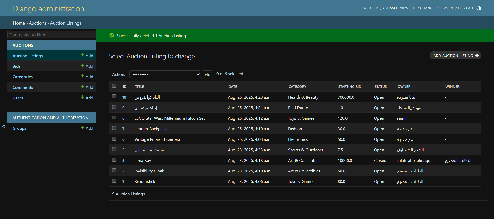

# Django Auctions — eBay-like Auction Site

This is a eBay-like auction site built with Django.  

## Features
- User authentication (register, login, logout)
- Create auction listings with title, description, starting bid, optional image, and category
- Browse all active listings
- View individual listing pages with details
- Place bids (must exceed current highest bid or starting bid)
- Add and remove items from a personal watchlist
- Post comments on listings
- Close auctions (listing owner can declare winner)
- View listings by category
- Admin interface to manage users, listings, bids, and comments

  
  
  
  
  
  